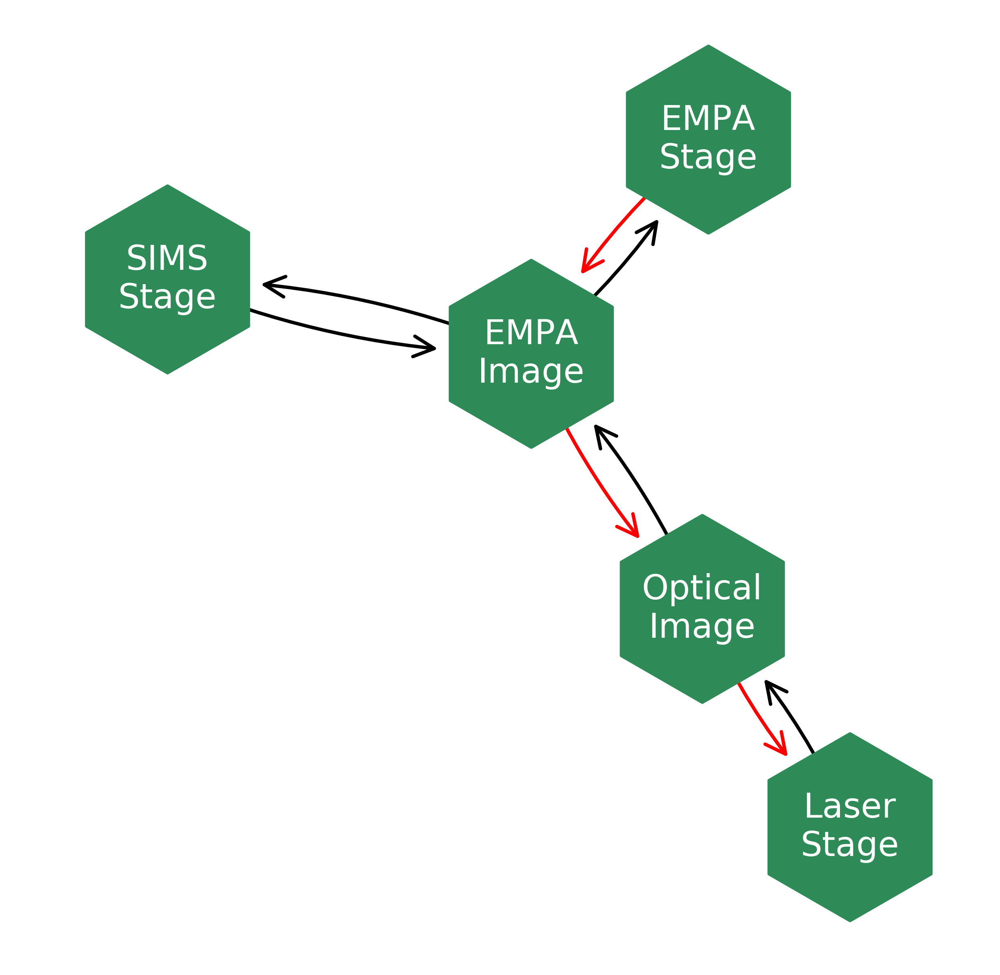
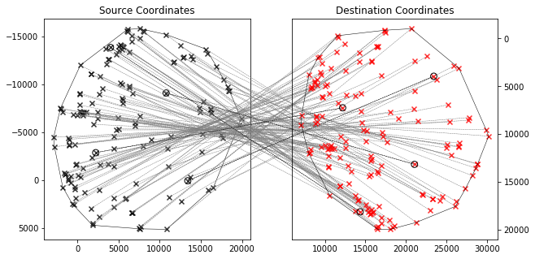

Use Cases
============

autopew is designed for easy referencing between analytical equipment and/or images.
This allows users to easily transfer between techniques such as electron probe,
laser ablation, scanning electron microscope or other imaging techniques.
autopew will allow consistent measurements of the same grains via different
techniques and give spatial context to chemical data.

There are a number of use cases that autopew is suited for:

Two Sets of Points
--------------------

E.g. coordinates from stages
This case is for transfer between various stage coordinate system (e.g. electron
probe and laser ablation) which can allow for measurement of the same grain with
different techniques.

What you need:

  * X,Y coordinates of the points you wish to analyse
  * at least 3 points in the new coordinate system

autopew can translate points with rotation, and shear.

.. seealso::

  `stage2stage workflow <workflows/stage2stage.html>`__

Image and Set of Points
-------------------------

If you have high resolution microscope images or images from other sources such
as X-ray fluorescence mapping you can use pixel coordinates and convert the
chosen points to the new stage coordinates.

This allows you to pick phases for analysis before your analytical session without
reducing the analytical time wasted on locating and programming the coordinates
of the phases of interest.

You can also mark analytical locations on a large image to give context
information to the microanalysis by converting stage coordinates to pixel coordinates.

What you need:

  * an image of high enough resolution to identify the target phases
  * 3 points in the new coordinate system that you can recognise on the image

  .. image:: ../_static/stage2image_concept.png
    :align: center
    :width: 80%

  .. seealso::

    `image to stage workflow <workflows/image2laser.html>`__,
    `stage to image workflow <workflows/stage2image.html>`__

Two Images
-------------
**in development**

See `the contributions page <../dev/contributing.html>`__ on how to contribute.

This allows the pixel coordinates from one image to be translated into the
pixel coordinates in a second image. This is useful if you need to overlay two
images such as an x-ray fluorescence image over a reflected light images

What you need:

  * two images you wish to overlay
  * 3 features you can recognise on both images
