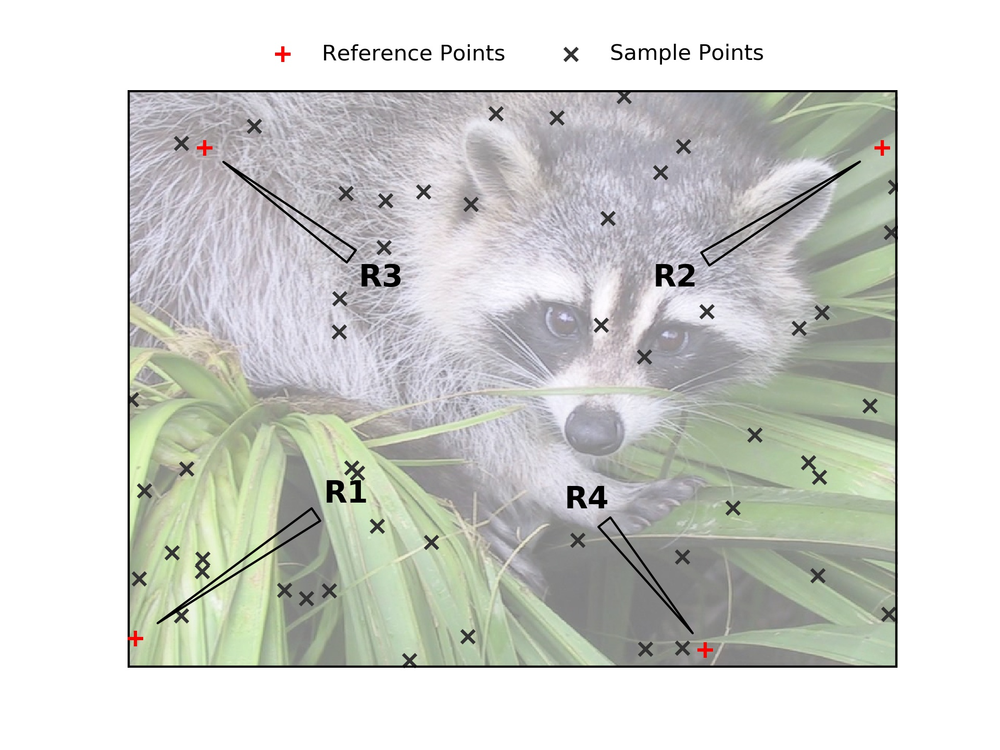

Image to Stage
===============

This is a simple workflow example involving converting points registered on an image
to coordinates for a specific stage.

INPUT: image of sample

OUTPUT: coordinates for use in navigating sample

e.g we have been using this method to extract phases from reflected light
imagery or X-ray fluorescence mapping and assign numbers to grains to give
spatial context to the multiple different micro-geochemical analysis.

Input and output can be easily changed for your purposes see
`the contributions page <../../dev/contributing.html>`__ for more information on
how to contribute.

Step 1: Acquire an Image and Register Points
---------------------------------------------

  * Aquire an image of your sample
  * add points to your image

Once an image is acquired, points can be added using **autopew** directly or using external software (e.g. `ImageJ or Fiji <https://imagej.net/Welcome>`__ [*]_
).  If you use ImageJ, export your points as a .csv file and follow
the `Stage to stage <stage2stage.html>`__ workflow which outlines transforming a
list of X,Y coordinates into a new translation. The following workflow is designed using the
**autopew** extensions.

For selection points directly in **autopew** here is an example:

Step 3: Calibrate the Transformation between the Image and Stage
-----------------------------------------------------------------

  * Pick a 3 or more calibration points

Note that the calibration of this transform involves a least-squares process to find
the optimal transformation, such that adding more calibration points can help avoid
minor inaccuracies in adding points.

Step 4: Transform Image Point Coordinates to Stage Coordinates
---------------------------------------------------------------

  * give the same reference points in the stage Coordinates (in this case laser reference coordinates)
  * Use **autopew** to transform all pixel coordinates to stage coordinates. See the example code below:

Step 5: Export Points to for Stage Coordinates
-------------------------------------------------

  * Export the transformed point stage coordinates to a file you can import into the software controlling the stage.

  .. code-block:: bash

    import numpy as np
    from pathlib import Path
    from autopew import Pew
    from autopew.workflow import pick_points

    # %% PICK THE ANALYSIS POINTS FROM AN IMAGE ------------------------------------------------------------
    # have an image you wish to use?
    imagepath = Path("./../../source/_static/") / "img.jpg"

    # pick sample coordinates from the image
    Sample_points = pick_points(imagepath)

    # %% REFERENCE POINTS ------------------------------------------------------------
    #these are the known locations of the reference points on the laser stage
    laser_REF_coords = np.array([
          [74978,85419], #R1
          [80259,75389], #R2
          [90828,82571], #R3
          [81465,74373]]) #R4

    # pick sample coordinates from the image
    Sample_REF_points = pick_points(imagepath)

    # %% TRANSFORM ---------------------------------------------------------------
    points = (Pew(Sample_REF_points,
                  laser_REF_coords)
                  .load_samples(Sample_points))
    # %% VISUALISE ------------------------------------------------------------
    from autopew.util.plot import plot_transform
    fig = plot_transform(
        points.samples[['x', 'y']].values,
        points.transformed[['x', 'y']].values,
        invert0=[False, False],
        invert1=[False, False]
    )

    # %% EXPORT -----------------------------------------------------------
    # lets save them so we can directly import them to the laser, with a known focal length (20744)
    points.export_samples("samples.scancsv", z=20744)

.. seealso::

  `output types <../outputs.html>`__

Optional Next Steps
---------------------

  * Export an aligned image.

Imported images can be realigned to the stage coordinate system for easier
recognition of sample features and more accurate visual determination of new point
location. See `stage to image <./stage2image.html>`__

References
~~~~~~~~~~~

  .. [*] Schneider, C. A.; Rasband, W. S. & Eliceiri, K. W. (2012), "NIH Image
    to ImageJ: 25 years of image analysis", Nature methods 9(7): 671-675, PMID 22930834
