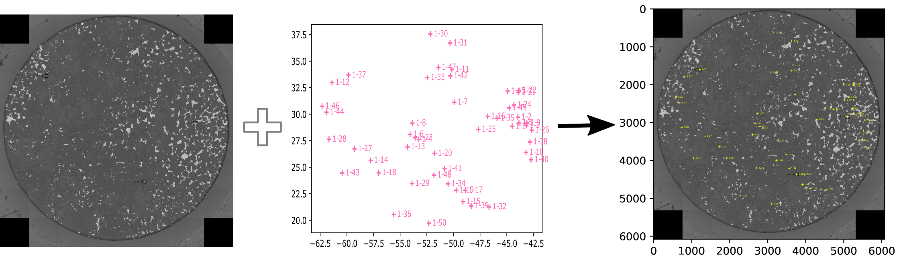

Stage to Image
=================

This is a simple workflow example involving converting points from one stage coordinate
system to display on a large image. This helps to visualise where the analysis
were collected and gives context to the anaysis.

INPUT:
  * .csv - a list of X,Y coordinates with spotnames + more than 3 reference points
  * large image with locations of more than 3 reference points

OUTPUT:
  * image with points labelled

e.g. We have been using the workflow to visualise the microanalysis points from
SEM on large reflected light images

Input and output can be easily changed for your purposes see
`the contributions page <../../dev/contributing.html>`__ for more information on
how to contribute.

Step 1: Acquire image
------------------------------

  * collect an image of the sample
  * Remember to highlight 3 regions or more for registration points

Step 2: Calibrate and Transform the points between the the image and the stage
--------------------------------------------------------------------------------

  * Import your CSV file with analysed points
  * specify your >3 reference coordinates using the **autopew** interactive interface
  * specify the stage Coordinates of these reference points
  * Use **autopew** to transform all stage coordinates. See the example code below:

Note that the calibration of this transform involves a least-squares process to find
the optimal transformation, such that adding more calibration points can help avoid
minor inaccuracies in adding points.

.. code-block:: bash

    from pathlib import Path
    import numpy as np
    import matplotlib.pyplot as plt
    from PIL import Image
    from autopew import Pew
    from autopew.workflow import pick_points

    imagepath = Path("./../../source/_static/") / "SEM_RefPoints.png"

    # %% REFERENCE POINTS ------------------------------------------------------------
    #these are the known locations of the reference points in the laser coordinate system
    laser_reference_coords =np.array([[45633,9098],  #R1-ccp55
                                      [56683,17876], #R2-ccp33
                                      [43301,16082], #R3-ccp38
                                      [42096,5137]]) #R4-pn25

    #pick the reference points on the image
    img_reference_coords = pick_points(imagepath)

    # %% TRANSFORM laser to pixels ---------------------------------------------------------------
    points = (Pew(laser_reference_coords,
                  img_reference_coords)
                  .load_samples('Samples.csv'))

Step 4: Overlay the image and the points
------------------------------------------------------

  * Export an image containing labelled point overlay over image

.. code-block:: bash

    # FIND THE PIXEL SIZE OF THE IMAGE
    img = Image.open(imagepath)
    # get the image's width and height in pixels
    width, height = img.size

    fig, ax = plt.subplots()
    ax.scatter(points.transformed['x'], points.transformed['y'],facecolors='none', edgecolors='y', marker="o",zorder=1,s=6,linewidth=.3)

    for i, df in enumerate(points.transformed['name']):
      ax.annotate(df, (points.transformed.x[i], points.transformed.y[i]),
                  xytext=(2, 0), textcoords='offset points',
                  horizontalalignment='left', verticalalignment='center',
                  size=4, color='yellow',
                  zorder=1)
    ax.set(xlim=(0, width), ylim=(0, height))

    plt.imshow(img, zorder=0)
    ax.invert_yaxis()#image invert so it is the same up direction as import.

    plt.tight_layout()
    plt.show()
    #fig.savefig('Export_image.png', transparent=True, dpi=800)

.. seealso::

  `output types <../outputs.html>`__
